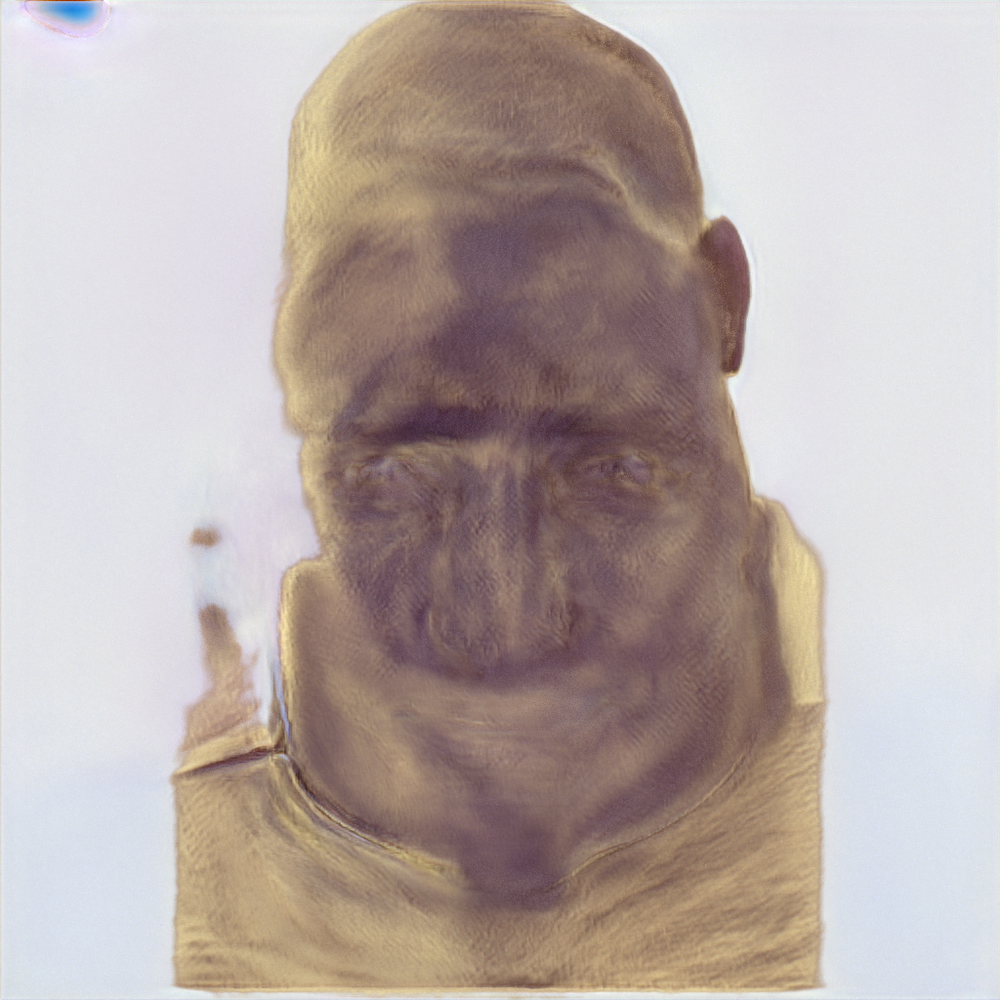
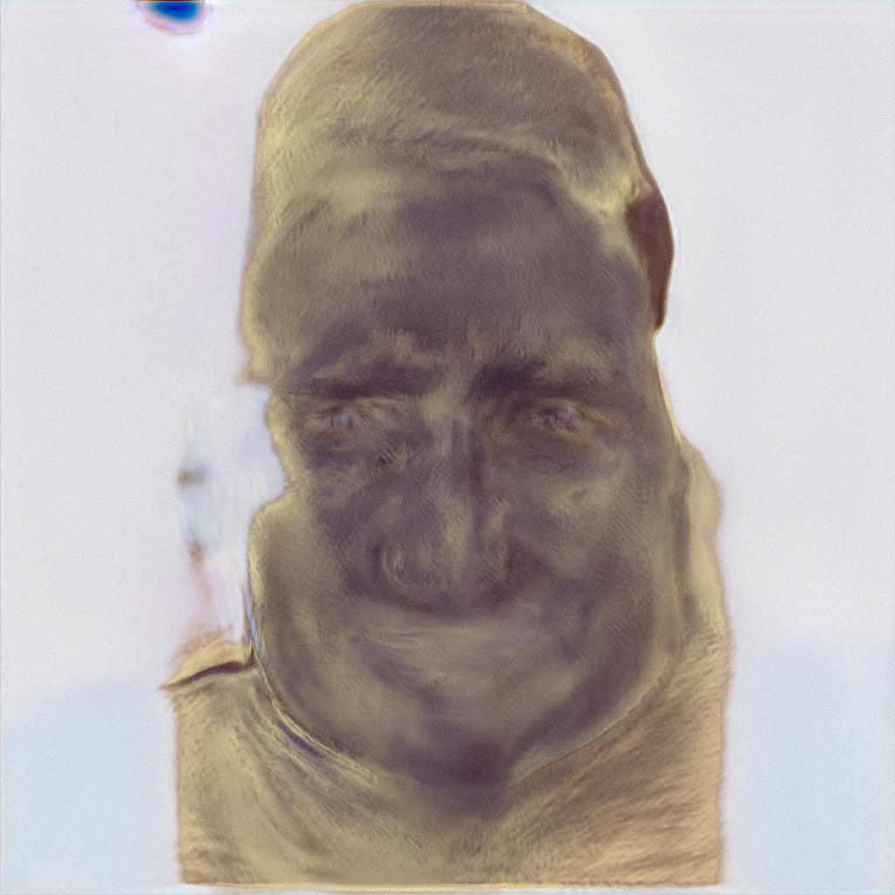

# Replication for Image2StyleGan

This repository is for replication for Image 2 StyleGAN

## Image2StyleGan latent vector backpropagation result

  
   

  
   

## Image2StyleGan morphing test result

  
  
  
  
  
  
  
  
  
  

